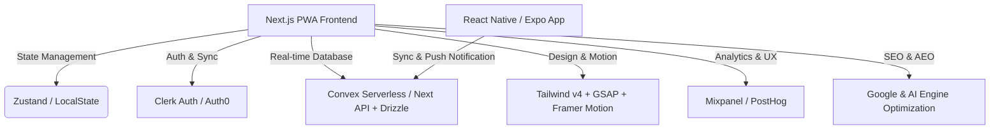

# Clockivo.com - Second Version (v2.0) Implementation Plan 🚀

Clockivo.com को एक साधारण उपयोगिता (utility) वेबसाइट से अपग्रेड करके एक **Premium, State-of-the-Art, और High-Performance Product** में बदलने के लिए यह एक विस्तृत रोडमैप है। 

इस प्लान में हम मेरे पास बची हुई विशेष **Skills** (जैसे Design Spells, Database Architecture, Security, Testing, SEO और Mobile Apps) का उपयोग करके इसके करंट फीचर्स को अपग्रेड करेंगे और नए क्रांतिकारी फीचर्स जोड़ेंगे।

---

## 🏗️ Proposed Architecture (Next-Gen Stack)

---

## 1. 🎨 Frontend Design & Micro-interactions (Skills: `antigravity-design-expert`, `frontend-design`)

करेंट वर्जन में सामान्य UI/UX है, जिसे हम **Spatial UI** और **Premium Aesthetics** के साथ अपग्रेड करेंगे:

### 🌟 नए फीचर्स (New Features)
- **Fluid Liquid-Glass Theme (Glassmorphism 2.0)**: Frosted glass elements, dynamic drop shadows, real-time backdrop-blur filters और hover-responsive gradient light streaks।
- **GSAP 3D Interactive Clocks**: Analog clock में 3D झुकाव (3D Tilt effect) और dynamic smooth shadows, जो कर्सर के मूवमेंट के साथ बदलती हैं।
- **Sound Wave Visualizer**: जब अलार्म या टाइमर बजेगा, तो बैकग्राउंड में एक अत्यंत सुंदर, fluid CSS/SVG canvas-based sound visualizer वेव चलेगी।
- **Particles Effect on Timer Finish**: टाइमर पूरा होने पर स्क्रीन पर soft particle explosion animations।

### 🛠️ करंट फीचर्स में सुधार (Current Enhancements)
- **Tab Transition Magic**: Framer Motion / GSAP का उपयोग करके टैब बदलने पर spatial fluid sliding transitions।
- **Ambient Dark Mode (Curated HSL Palette)**: सामान्य डार्क थीम की जगह गहरे अंतरिक्ष जैसी (Deep Slate/Violet HSL) थीम और neon-glow active states।
- **Interactive Stopwatch Laps**: लैप्स रिकॉर्ड होने पर वे एक-एक करके micro-spring animations के साथ लिस्ट में जुड़ेंगे।

---

## 2. 🗄️ Backend Sync & Real-time Database (Skills: `database-architect`, `convex`, `api-patterns`)

अभी सारा डेटा `localStorage` में है, जो ब्राउज़र कैशे डिलीट होने पर गायब हो जाता है। v2.0 में हम इसे क्लाउड पर ले जाएँगे:

### 🌟 नए फीचर्स (New Features)
- **User Accounts & Cloud Sync (Clerk Auth)**: यूजर Google/GitHub से लॉगिन कर सकेगा। उसके अलार्म, कस्टम साउंड्स और टाइमर सेटिंग्स सभी डिवाइसेज पर लाइव सिंक होंगी।
- **Shared Focus Rooms (WebSockets)**: यूजर एक "Shared Countdown Room" बना सकेगा जहाँ कई लोग (जैसे ऑनलाइन स्टडी ग्रुप) एक साथ एक ही टाइमर को सिंक में देख सकेंगे।
- **Productivity & Focus Analytics**: एक सुंदर डैशबोर्ड जो यह ट्रैक करेगा कि यूजर ने हर दिन कितना टाइमर/स्टॉपवॉच का इस्तेमाल किया (डाटा विज़ुअलाइज़ेशन चार्ट के साथ)।

### 🛠️ करंट फीचर्स में सुधार (Current Enhancements)
- **Offline-First Storage**: अगर यूजर ऑफ़लाइन है, तो अलार्म और सेटिंग्स स्थानीय रूप से सिंक होंगी और ऑनलाइन आते ही डेटाबेस से मर्ज हो जाएँगी।

---

## 3. 📱 Mobile Companion App (Skills: `building-native-ui` - Expo, `flutter-expert`)

Clockivo.com को सिर्फ एक वेबसाइट न रखकर इसे मोबाइल इकोसिस्टम में लाएँगे:

### 🌟 नए फीचर्स (New Features)
- **Expo React Native Companion App**: Clockivo की एक पूरक एंड्रॉइड/iOS ऐप जो सीधे वेब अलार्म्स के साथ सिंक करेगी।
- **Native Push Notifications**: टाइमर खत्म होने या अलार्म बजने पर मोबाइल पर सिस्टम-लेवल पुश नोटिफिकेशन (भले ही ब्राउज़र बंद हो)।
- **Lock Screen & Desktop Widgets**: होम स्क्रीन और लॉक स्क्रीन पर लाइव काउंटडाउन दिखाने वाले सुंदर विजेट्स।

---

## 4. 🔒 Security & Performance Hardening (Skills: `007`, `frontend-security-coder`)

### 🌟 नए फीचर्स (New Features)
- **Secure Local Storage**: अगर डेटा बिना लॉगिन के सेव होता है, तो उसे AES/Crypto-JS से एन्क्रिप्ट करके रखना ताकि कोई स्क्रिप्ट अलार्म डेटा न चुरा सके।
- **Strict Content Security Policy (CSP)**: कस्टम मीडिया हब (Custom Media Hub) में यूजर द्वारा बाहरी ऑडियो लिंक्स डालने पर XSS (Cross-Site Scripting) को रोकने के लिए सैनिटाइजेशन और सख्त CSP हेडर नियम।

---

## 5. 📈 SEO, AI SEO & Analytics (Skills: `ai-seo`, `analytics-tracking`, `free-tool-strategy`)

### 🌟 नए फीचर्स (New Features)
- **AEO (Answer Engine Optimization)**: स्कीमा मार्कअप (Schema.org / JSON-LD SoftwareApplication schema) को इस तरह ऑप्टिमाइज़ करना कि जब कोई ChatGPT, Gemini या Perplexity से पूछे "Best online stopwatch with custom sounds", तो Clockivo.com पहले नंबर पर साइट (cite) हो।
- **Privacy-Friendly Analytics (PostHog/Mixpanel)**: बिना कुकीज़ के यह समझना कि यूजर्स अलार्म, स्टॉपवॉच, टाइमर में से किसका सबसे ज्यादा इस्तेमाल कर रहे हैं ताकि हम उसी फीचर पर फोकस कर सकें।

---

## 6. 🧪 Automated Testing & Reliability (Skills: `e2e-testing`, `error-detective`)

### 🛠️ करंट फीचर्स में सुधार (Current Enhancements)
- **Playwright E2E Tests**: टाइमर और अलार्म्स की विश्वसनीयता 100% सुनिश्चित करने के लिए टेस्ट लिखना (जैसे: क्या अलार्म 10 घंटे बाद भी बिल्कुल सही समय पर बजता है? क्या साउंड प्लेबैक ऑटो-प्ले ब्लॉकिंग से सुरक्षित है?)।
- **Standard AudioContext Safety**: आधुनिक ब्राउज़र्स में बिना यूजर इंटरैक्शन के ऑडियो प्ले नहीं होता। इसके लिए एक बुलेटप्रूफ `Audio-Unlocker` फ्रेमवर्क बनाना जो सुनिश्चित करे कि अलार्म बिना किसी रुकावट के हमेशा बजे।

---

> [!IMPORTANT]
> **नोट (As per your instruction):**
> जब तक आप (User) अगला निर्देश नहीं देते, तब तक कोई भी कोड नहीं लिखा जाएगा और न ही कोई फीचर बनाया जाएगा। यह केवल आपके लिए विश्लेषण और प्लानिंग रिपोर्ट है।

**आप इनमें से किस दिशा में (जैसे: UI/UX अपग्रेड, क्लाउड सिंक, या मोबाइल ऐप) सबसे पहले काम शुरू करना चाहेंगे?** 🚀
